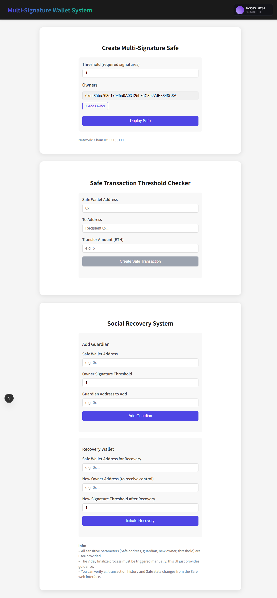

# 🛡️ Multi-Signature Wallet System with Safe SDK + Thirdweb Integration

This project implements a robust multi-signature wallet system for managing a corporate treasury using the **Safe SDK** and **Thirdweb SDK**. It combines advanced concepts from decentralized application development and secure asset management, offering enhanced governance, transaction control, and social recovery features.

---

## 🚀 Features

### 1. Multi-Signature Safe Wallet Creation
- Create a Safe wallet with a configurable list of owners and a threshold (number of required approvals).
- Built using `@safe-global/protocol-kit` and integrated with Thirdweb's wallet connection system.

### 2. Safe Transaction Threshold Checker
- Automatically detect and enforce multi-tier transaction approval logic:
  - **Routine Transactions (<10 ETH):** Require 2 of 4 signatures.
  - **large Transactions (10–100 ETH):** Require 3 of 4 signatures.
  - **Critical Transactions (>100 ETH or Owner changes):** Require 4 of 4 signatures (unanimous).
- This component checks the Safe's on-chain configuration and enforces the appropriate threshold before execution.

### 3. Social Recovery System
- Implements a **Guardian-based social recovery** module inspired by [Candide's social recovery mechanism](https://docs.candide.dev/wallet/plugins/recovery-with-guardians/).
- Allows wallet recovery through trusted guardians after a time-locked delay (e.g., 7 days).

---

## 🧱 Tech Stack

- **React (Next.js App)**
- **Thirdweb SDK** – wallet connection, chain access
- **Safe SDK (Protocol Kit)** – Safe deployment and management

## 🔧 Getting Started

### 1. Clone the Repository

git clone https://github.com/yourusername/multisig-wallet-app.git
cd multisig-wallet-app

### 2. Install Dependencies

npm install
#### or
yarn install

### 3. Configure Environment Variables
Create a .env.local file and add your Thirdweb Client ID:

NEXT_PUBLIC_THIRDWEB_CLIENT_ID=your_thirdweb_client_id

### 4. Run the Development Server

npm run dev
#### or
yarn run dev

### 📸 Preview

